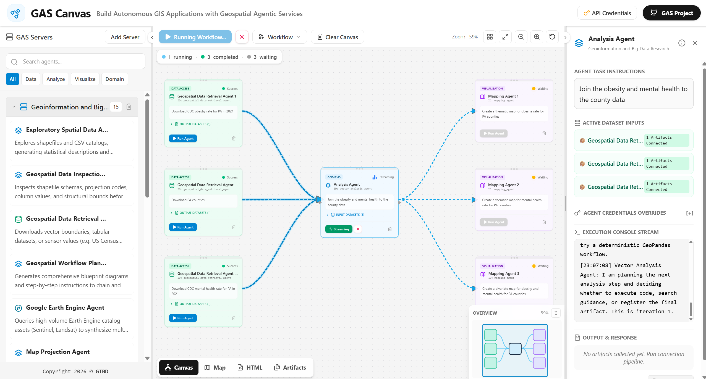

# GAS Canvas

GAS Canvas is the workflow-building interface for Geospatial Agentic Services.
It provides a visual canvas for composing GAS agents, executing workflows, and
inspecting generated artifacts in persistent workspace tabs.



The workspace combines the GAS Servers agent list, workflow canvas, execution
controls, mini-map overview, and agent inspector in one persistent interface.

## Open GAS Canvas

Use the public GAS Canvas deployment:

```text
https://www.geospatial-agentic-services.online/canvas
```

For local development setup, see [GAS Canvas Development](gas_canvas_development.md).

## Workspace Tabs

GAS Canvas uses four workspace tabs:

- `Canvas`: build and execute multi-agent workflows.
- `Map`: inspect spatial artifacts as map layers.
- `HTML`: render generated HTML applications and reports.
- `Artifacts`: inspect non-spatial and non-HTML artifacts.

Artifact routing is automatic:

- GeoJSON and GeoPackage artifacts open in `Map`.
- HTML and HTM artifacts open in `HTML`.
- CSV, JSON, TXT, images, and other files open in `Artifacts`.

Use `View All Artifacts` in the node inspector to route all outputs from a
completed node into the appropriate workspace tabs. If spatial artifacts are
present, the Map tab is activated first.

## Canvas Navigation

The Canvas tab is the workflow graph editor.

- Drag agents from the GAS Servers panel onto the canvas, or double-click an
  agent in the list to add it near the current viewport.
- Drag empty canvas space to pan the workflow.
- Use the mouse wheel to zoom in and out around the cursor.
- Use toolbar buttons for explicit zoom controls, zoom-to-fit, reset zoom, and
  auto-layout.
- Drag nodes to reposition them.
- Drag from input and output ports to connect agents.

Visible scrollbars are hidden; panning and zooming still use the underlying
scroll container to keep large workflows navigable.

## Workflow Controls

The top toolbar contains workflow-level actions:

- `Run Workflow`: executes the connected agent graph in dependency order.
- `Cancel Workflow`: appears while a workflow is running and cancels active
  tasks while marking waiting tasks as canceled.
- `Workflow`: opens a menu for saving, loading from browser storage, and
  importing workflow JSON files.
- `Clear Canvas`: removes all nodes and connections after confirmation.
- `Auto Layout`: arranges the workflow by dependency depth and zooms to fit.
- `Zoom to Fit`: centers and scales the current workflow without rearranging
  nodes.

Manual zoom and fit-to-workflow actions support zooming down to 10 percent for
large workflows.

Saved and imported workflows are centered automatically after loading so the
graph is visible in the canvas viewport.

## Workflow Status And Overview

When nodes are present, GAS Canvas shows a compact workflow status strip below
the toolbar. It summarizes node states, for example:

```text
3 running, 4 completed
```

The strip updates as nodes move through `idle`, `waiting`, `running`,
`completed`, `error`, and `canceled` states.

The lower-right mini-map provides an overview of large workflows:

- Agent boxes use the same light category colors as the full node cards.
- Connections show the graph structure at a glance.
- The blue viewport rectangle represents the visible canvas area.
- Drag the viewport rectangle to pan the main canvas.
- Use the mini-map corner button to collapse or expand the overview.

## Context Menus

Right-click actions are available throughout the canvas:

- Agent node menu: run, duplicate, copy, rename, edit task instructions, view
  details, and delete.
- Empty canvas menu: run or cancel the workflow, paste copied nodes, save,
  load, import, auto-layout, zoom controls, and clear canvas.
- Connection menu: delete a connection.
- GAS Servers panel agent menu: add to canvas, view details, or remove the
  agent from the visible server list.

Context menus are clamped to the browser viewport so they remain visible near
screen edges.

## Workflow Execution Rules

Single-agent execution respects workflow dependencies. If an agent has upstream
connections, its `Run Agent` button is disabled until all parent agents are
completed. The disabled button tooltip explains which upstream agents are still
blocking execution.

When an agent is rerun, GAS Canvas clears the previous run's streaming logs,
task request, task id, and output artifacts before the new stream begins.

During workflow execution, incoming connections to the currently running node
are highlighted with a stronger animated path. This makes the active dependency
path easier to see in large workflows.

## Agent Inspector

Selecting an agent opens the inspector panel. The inspector supports:

- Editing agent task instructions.
- Reviewing active dataset inputs.
- Setting per-node credential overrides.
- Running or canceling an agent task.
- Watching the execution console stream.
- Opening individual artifacts.
- Downloading request and response JSON.

## Map View

The Map tab is optimized for GIS outputs.

Supported spatial artifacts:

- GeoJSON
- GeoPackage

Map View capabilities:

- Select common Leaflet basemaps.
- Add multiple spatial artifacts as layers.
- Show and hide layers.
- Drag layers to reorder map draw order.
- Right-click a layer to view attributes or download the layer.
- Resize and hide the bottom attribute table.
- Style layers by geometry type:
  - Points: color, size, outline.
  - Lines: color and width.
  - Polygons: outline, fill color, fill opacity.

Geometry icons in the layer list are neutral outlines so they are not confused
with layer display colors.

## HTML View

The HTML tab renders generated HTML artifacts in a full-workspace iframe. HTML
is fetched through the local Canvas server and rendered with `srcDoc` to avoid
common remote iframe restrictions.

## Artifacts View

The Artifacts tab is for outputs that are neither spatial layers nor HTML
documents.

Supported previews:

- Images: PNG, JPG, JPEG, GIF, SVG, WebP.
- Tables: CSV and JSON arrays.
- Text/code: JSON objects, TXT, LOG, Markdown, XML, YAML.
- Other files: download fallback with a short snippet when available.
